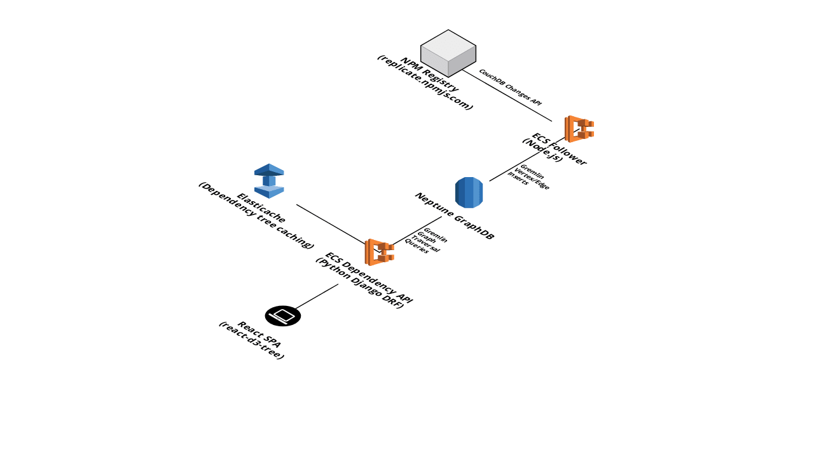

# snyk-challenge

## Description

An API and client for displaying npm package dependencies, as defined by the
Snyk interview challenge.

This repository contains:

- `cache` - terraform to create a Redis Elasticache instance to cache API
  responses
- `ecs_naive_api` - a Node Express API which queries the registry and serves a
  dependency tree for a given package, as well as terraform ECS and ELB
  resources to host the API
- `client` - a React app to visualise the dependency tree

It is also worth noting that an initial approach to this challenge was aborted.
This involved using a graph database to represent dependency graphs, and a
persistent npm follower to receive all registry changes and avoid polling
behaviour, as well as a Python Django DRF API to front the graph DB. While it
is quick and easy to implement recursive polling behaviour (hence 'naive' API),
it is not good engineering to make multiple onward requests while the API
client is waiting for a response.

The approach was aborted due to rising AWS costs and lack of time, but the
implementation worked correctly when limited to following the npm registry for
a small set of packages (rather than modelling all packages and dependencies
throughout the public registry).

These modules are:

- `graphdb`
- `ecs_api`
- `ecs_follower`

## Installing

To run terraform and create infrastructure:

- `echo 'profile = "<AWS profile to use from credentials file>"' > terraform.tfvars`
- `terraform init`
- `terraform apply`
- See terraform output for API URL

Alternatively:

To run the API locally without a cache (ignore cache connection refusal, the
client uses a retry backoff strategy, the API functions):

- `cd ecs_naive_api`
- `docker build -t ecs_naive_api .`
- `docker run -it -p 8000:8000 ecs_naive_api`

To run the React client app locally:

- `cd client`
- `npm install`
- `npm start`

API endpoint is currently hardcoded in `client/src/App.js`.

## Current Design

## Initial Design

## TODO before production

- It needs resilience and scalability tuning (ECS and Neptune horizontal and
  vertical scaling, health checking and automated recovery etc.)
- It needs a CI/CD pipeline to automate builds, tests and deployment
- It needs local development and staging environments to ease further development
- It needs a complete security lockdown on all of the terraform infrastructure and apps
  - Take out / lockdown Django administration, and follow Django production
    checklist for secrets, debug settings, add API auth etc.
  - Replace default VPC + public subnet with tiered VPC networking and security groups
  - Reduce IAM role permissions
- It only checks dependencies (not peerDependencies or devDependencies)
- For each change from the registry, it could try to detect which version was
  being changed, currently it updates the graph with dependencies for every
  version of the package
- An alternative data structure with package versions as vertices instead of
  edge properties should be explored
- Gremlin scripts are being submitted instead of bytecode-based requests. This
  is because replicating gremlin syntax in different programming languages can
  be a pain - just needs a bit more research to convert in 
  `dependencyapi/api/views.py in BaseRetrieveView::get_object`
