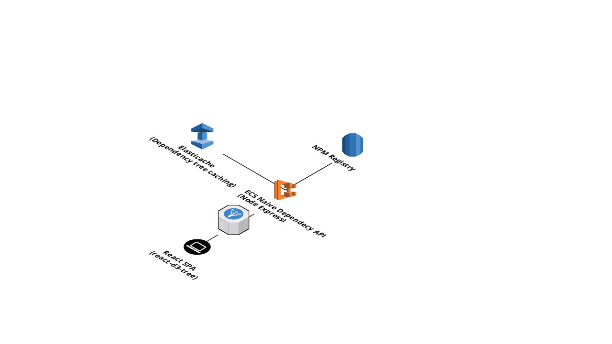

## High level design

## TODO before production

- It needs resilience and scalability tuning (ECS and Neptune horizontal and
  vertical scaling, health checking and automated recovery etc.)
- It needs a CI/CD pipeline to automate builds, tests and deployment
- It needs local development and staging environments to ease further development
- It needs a complete security lockdown on all of the terraform infrastructure and apps
  - Take out / lockdown Django administration, and follow Django production
    checklist for secrets, debug settings, add API auth etc.
  - Replace default VPC + public subnet with tiered VPC networking and security groups
  - Reduce IAM role permissions
- It only checks dependencies (not peerDependencies or devDependencies)
- For each change from the registry, it could try to detect which version was
  being changed, currently it updates the graph with dependencies for every
  version of the package
- An alternative data structure with package versions as vertices instead of
  edge properties should be explored
- Gremlin scripts are being submitted instead of bytecode-based requests. This
  is because replicating gremlin syntax in different programming languages can
  be a pain - just needs a bit more research to convert in 
  `dependencyapi/api/views.py in BaseRetrieveView::get_object`
